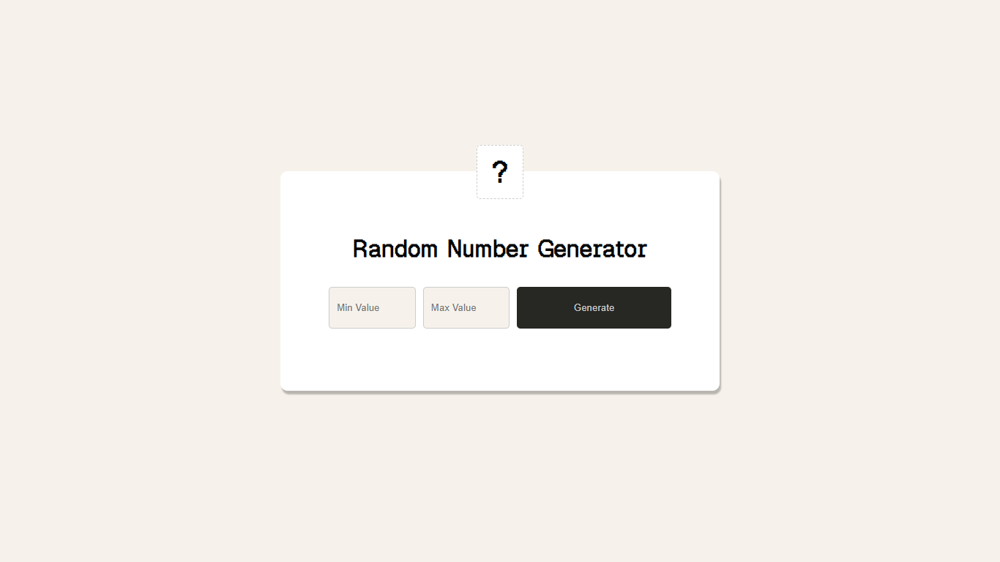
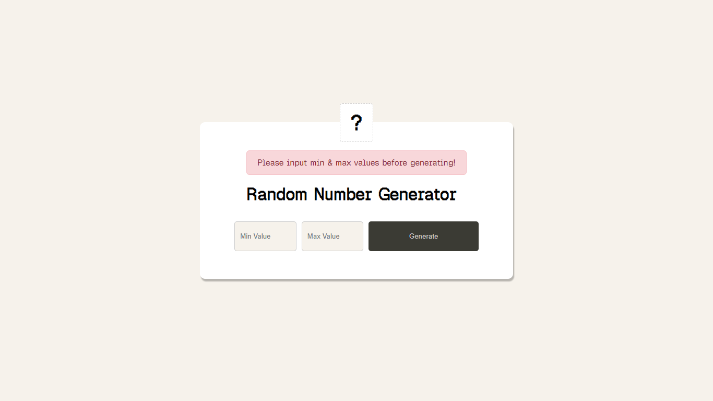

# Random Number Generator

A minimal tool that generates a random integer between a specified
minimum and maximum value, with input validation.

## Live Demo

[Link here once deployed]

## Screenshots

|              Default View               |            Error Handling             |            Error Handling             | Active State                           |
| :-------------------------------------: | :-----------------------------------: | :-----------------------------------: | -------------------------------------- |
|  |  |  |  |

## Features

- Set a custom min and max range
- Validates empty inputs and invalid ranges
- Generates inclusive random integers using Math.random()

## Tech Stack

HTML, CSS, JavaScript (no frameworks)

## What I Learned

- How Math.random() and Math.floor() work together for integer generation
- DOM input validation without a library
- Separating generation logic from display logic

## Known Limitations

- No decimal support — integers only
- No history of previously generated numbers

## What I'd Improve With More Time

- Copy to clipboard button
- History of last 5 generated numbers
